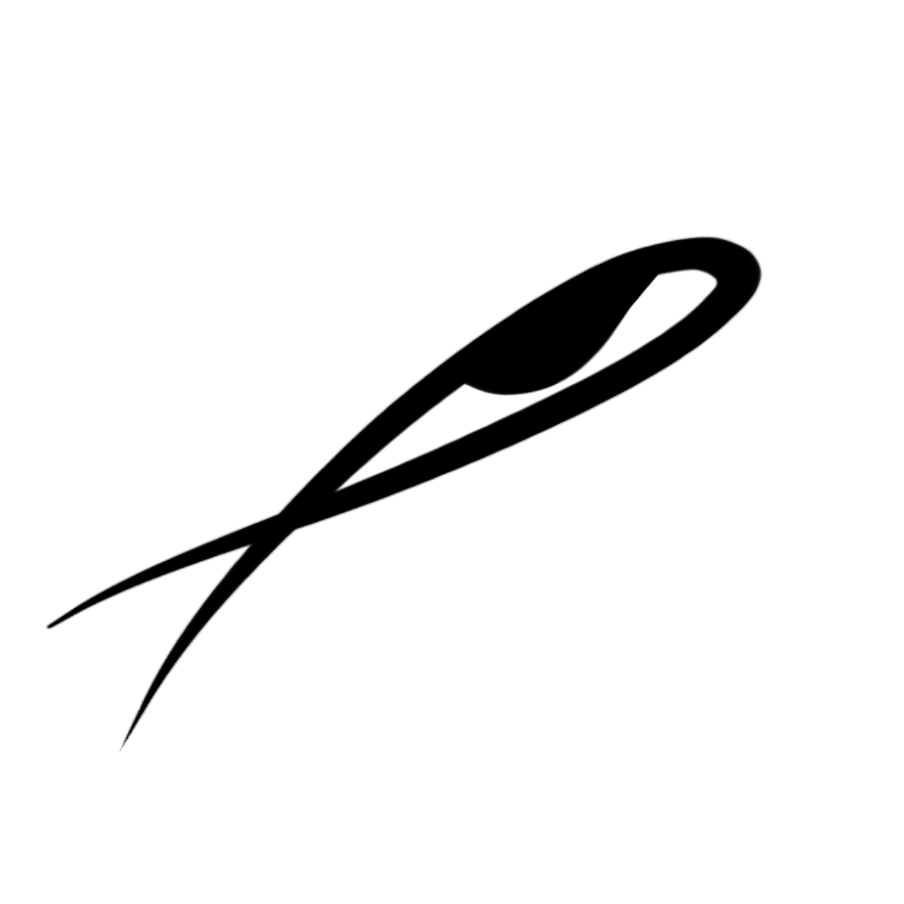

# EDITOR DE IMAGEM PHATON

  

  <strong>Editor de imagem profissional baseado em HTML5 Canvas e Tailwind CSS, otimizado para a web.</strong>

  
  
  
  

---

## Índice de Tópicos

* [Sobre o Projeto](#sobre-o-projeto)
* [Tecnologias Utilizadas](#tecnologias-utilizadas)
* [Funcionalidades de Destaque](#funcionalidades-de-destaque)
* [Interface do Usuário](#interface-do-usuário)
* [Compatibilidade](#compatibilidade)
* [Como Usar](#como-usar)
* [Deploy no Vercel](#deploy-no-vercel)
* [Performance e Otimização](#performance-e-otimização)
* [Autor](#autor)

---

## Sobre o Projeto

O **Phaton** é um editor de imagem profissional web projetado para rodar inteiramente no lado do cliente (client-side). Ele permite que designers e usuários finais realizem edições de imagens, remoções de fundo e manipulação de pixels diretamente em seus navegadores, sem a necessidade de baixar softwares pesados ou realizar upload de imagens para servidores remotos, o que garante máxima privacidade de dados e velocidade de execução.

O projeto utiliza a API nativa do Canvas HTML5 para manipular o mapa de pixels da imagem (ImageData) de forma direta e otimizada. A interface do usuário é construída de maneira dinâmica e estilizada com Tailwind CSS, oferecendo uma experiência premium com feedback visual instantâneo para retoques minuciosos, controle de proporção de aspecto, filtros estéticos e ferramentas inteligentes como a varinha mágica e preenchimento por inundação (flood fill).

---

## Tecnologias Utilizadas

* **HTML5 Canvas**: Utilizado para renderizar a imagem, processar as matrizes de pixels em tempo real e desenhar os overlays de seleção/panning.
* **JavaScript (ES6+)**: Lógica principal para cálculo de tolerância de cores, algoritmos de preenchimento (flood fill), filtros de nitidez por convolução de matrizes e filtros bilaterais para suavização de pele.
* **Tailwind CSS**: Framework CSS que provê a interface do usuário responsiva, moderna, com suporte para o modo escuro e transições de tela suaves.
* **Vercel**: Plataforma de nuvem otimizada para deploy contínuo (CI/CD) de aplicações estáticas direto do repositório Git.

---

## Funcionalidades de Destaque

### Remoção de Fundo
* **Remoção Automática**: Um clique analisa a cor do pixel do canto superior esquerdo e remove todas as cores correspondentes ao fundo da imagem.
* **Remoção Manual**: Permite que o usuário clique em qualquer ponto específico do fundo para apagar aquela cor de forma cirúrgica.
* **Tolerância de Cor Ajustável**: Slider dinâmico que define o quão parecida uma cor deve ser para ser removida, protegendo elementos de primeiro plano.

### Ferramentas de Retoque
* **Varinha Mágica**: Seleciona e remove áreas contíguas baseado na proximidade cromática dos pixels selecionados.
* **Pincel e Edição Direta**: Permite focar em detalhes para limpeza de bordas e retoques manuais com precisão.

### Filtros e Finalização
* **Melhoria de Nitidez**: Aplica uma matriz de convolução (Laplacian) para acentuar os detalhes e linhas da imagem.
* **Polimento HD (Filtro Bilateral)**: Suaviza imperfeições mantendo a nitidez das bordas, simulando efeitos de câmeras de alta fidelidade.
* **Pixel Art**: Reduz a densidade de pixels e a paleta de cores para transformar qualquer foto em arte retro de 8/16 bits.
* **Brilho e Contraste**: Controles analógicos para ajustar a iluminação geral da imagem.

### Controle de Resolução e Zoom
* **Presets de Resolução**: Redimensionamento rápido para Full HD (1920x1080), HD (1280x720) ou formato Quadrado para redes sociais (1080x1080).
* **Trava de Proporção**: Impede distorções indesejadas, garantindo que o redimensionamento respeite a proporção original.
* **Zoom até 10x**: Scroll do mouse permite aproximar-se de detalhes microscópicos da imagem.
* **Pan Interativo**: Movimentação por arraste para editar facilmente diferentes partes da imagem ampliada.

### Gerenciamento de Estado
* **Desfazer Ações (Ctrl+Z)**: Sistema local que armazena os estados anteriores no Canvas para permitir reversões instantâneas.
* **Reset de Alterações**: Opção rápida para descartar todas as modificações e voltar à imagem original.
* **Download Customizado**: Exportação em alta qualidade PNG com opção de nomear o arquivo final.

---

## Interface do Usuário

* **Layout Dark Premium**: Cores sóbrias e contraste refinado para evitar fadiga ocular durante edições longas.
* **Totalmente Responsiva**: Ajustes perfeitos de interface para notebooks, desktops ou dispositivos móveis.
* **Indicadores Visuais**: Transições fluidas, tooltips com atalhos de ferramentas e loaders de processamento ativos.

---

## Compatibilidade

O editor Phaton foi homologado e opera de maneira consistente nos seguintes ambientes:
* Chrome e navegadores baseados em Chromium (Edge, Opera, Vivaldi, Brave)
* Mozilla Firefox
* Apple Safari (Desktop e Mobile iOS)
* Navegadores integrados em celulares Android e tablets

---

## Como Usar

1. Clique no botão **Carregar Imagem** na barra superior e selecione o arquivo local da sua máquina.
2. Utilize a roda do mouse para aproximar ou afastar o zoom na área que deseja editar. Pressione e arraste para mover-se pela tela ampliada.
3. Escolha entre a remoção de fundo automática ou clique diretamente nas áreas com a Varinha Mágica, regulando a barra de **Tolerância** para refinar o resultado.
4. Utilize os filtros de nitidez, polimento ou pixel art e faça os ajustes necessários na luminosidade e contraste.
5. Escolha uma resolução nas opções de preset ou ajuste de forma manual (mantendo a proporção de aspecto se desejar).
6. Clique em **Download**, dê um nome ao seu arquivo e exporte a imagem em formato PNG com fundo transparente.

---

## Deploy no Vercel

O projeto conta com o arquivo [vercel.json](vercel.json) configurado na raiz para garantir implantação estática imediata:
1. Faça o envio da pasta local para o seu repositório remoto no GitHub.
2. Acesse a plataforma da Vercel e conecte sua conta do GitHub.
3. Importe o repositório **Phaton-Edit-Imagem**.
4. Clique em **Deploy**; a plataforma detectará o arquivo estático principal (`index.html`) e fará a publicação na web de forma automática.

---

## Performance e Otimização

* **Manipulação de Buffer**: Algoritmos otimizados que iteram sobre arrays de bytes unidimensionais de forma linear, garantindo que o processamento do Canvas seja extremamente rápido.
* **Gerenciamento Eficiente de RAM**: Histórico inteligente projetado para limitar a quantidade de estados em cache, prevenindo lentidão e estouro de memória no navegador.

---

## Autor

<table>
  <tr>
    <td align="center">
      <a href="https://github.com/ThyagoToledo">
        
         
        <b>Thyago Toledo</b>
      </a>
    </td>
  </tr>
</table>
